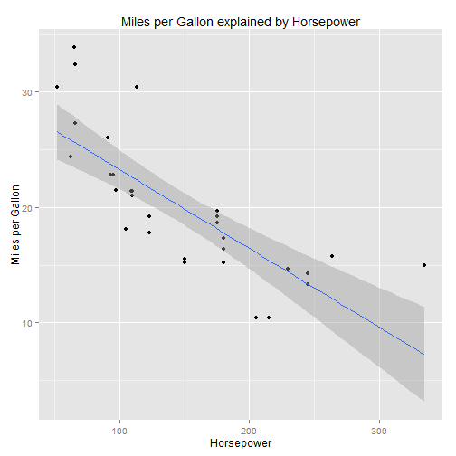

#### Introduction1

In this project i tried to show what factors of a motor car influences miles per gallon (MPG).

I looked at following variables:

1. Weight (lb/1000)
2. Horse Power
3. Displacement (cu.in.)

---
#### Start the Shiny application

The interactive Shiny application can be found here: https://ollib.shinyapps.io/project/

---
#### This project uses ggplot2 to display scatterplots


```r
library(ggplot2)
print(ggplot(mtcars, aes(x = hp, y = mpg)) + geom_point() + xlab("Horsepower") + 
                           ylab("Miles per Gallon") + ggtitle("Miles per Gallon explained by Horsepower") +
                           geom_smooth(method=lm, se=TRUE))
```



---
#### Conclusion
 
Please buy a small car or use public transport :-)

Thanks for watching!


